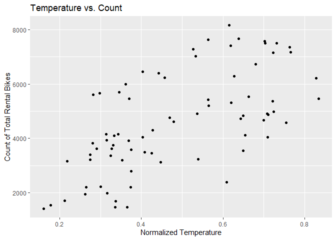
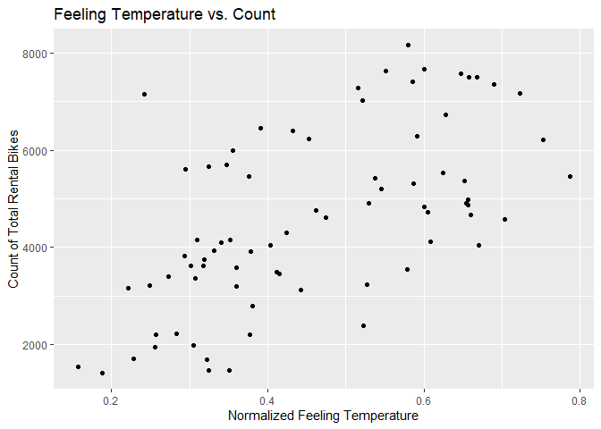
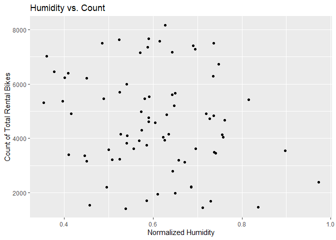
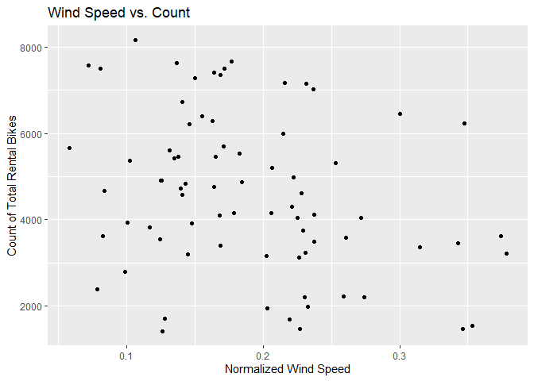

# Introduction

The data we will be analyzing in this project is a daily count of rental
bikes between years 2011 and 2012 in the Capital bikeshare system. This
bike share data set includes information about the day of rental and the
weather on that particular day. Below is a list of the variables that
will be available for us to include in our models and a brief
description:

  - `season` : season (1:winter, 2:spring, 3:summer, 4:fall)
  - `yr` : year (0: 2011, 1:2012)
  - `mnth` : month ( 1 to 12)
  - `holiday` : weather day is holiday or not
  - `weekday` : day of the week
  - `workingday` : if day is neither weekend nor holiday is 1, otherwise
    is 0
  - `weathersit` :
      - 1: Clear, Few clouds, Partly cloudy, Partly cloudy
      - 2: Mist + Cloudy, Mist + Broken clouds, Mist + Few clouds, Mist
      - 3: Light Snow, Light Rain + Thunderstorm + Scattered clouds,
        Light Rain + Scattered clouds
      - 4: Heavy Rain + Ice Pallets + Thunderstorm + Mist, Snow + Fog
  - `temp` : Normalized temperature in Celsius
  - `atemp`: Normalized feeling temperature in Celsius
  - `hum`: Normalized humidity
  - `windspeed`: Normalized wind speed
  - `cnt`: count of total rental bikes

The purpose of this analysis is to compare two models in terms of their
predictive performance. As this is a regression problem, we will use
RMSE to determine which model is the better fit. The models we will fit
are a non-ensemble tree model and a boosted tree model. Tuning
parameters for both models will be selected using leave one out cross
validation. We will fit both of these models on the training data set
and evaluate the RMSE on the test set.

# Loading Packages

We will load in our necessary packages, `tidyverse` and `caret`. We will
also set the seed, so our results are reproducible.

``` r
set.seed(123)
library(tidyverse)
library(caret)
library(ggplot2)
```

# Reading in Data

Using the `read_csv` function, we will read in the csv file of the bike
sharing data. With the use of the `select` function, we can remove the
`casual` and `registered` variables, which should not be used for
modeling, and any non-numeric variables, like `dteday`. Finally, using
`filter`, we will filter our data set by the specific day of the week we
are interested in analyzing for that report.

``` r
bikeData <- read_csv("day.csv")
bikeData <- bikeData %>% select(-c(casual, registered, instant, dteday)) %>% filter(weekday == params$dayofWeek)
```

# Creating Training and Test Split

Using `createDataPartition`, we will partition our data into the 70/30
training and test split.

``` r
bikeDataIndex <- createDataPartition(bikeData$cnt, p = 0.7, list = FALSE)
bikeDataTrain <- bikeData[bikeDataIndex, ]
bikeDataTest <- bikeData[-bikeDataIndex, ]
```

# Summarizations of Data

First, we will take a look at the five number summary of each variable
available in the data set.

``` r
summary(bikeDataTrain)
```

    ##      season           yr              mnth         holiday           weekday    workingday    
    ##  Min.   :1.00   Min.   :0.0000   Min.   : 1.0   Min.   :0.00000   Min.   :5   Min.   :0.0000  
    ##  1st Qu.:2.00   1st Qu.:0.0000   1st Qu.: 4.0   1st Qu.:0.00000   1st Qu.:5   1st Qu.:1.0000  
    ##  Median :2.00   Median :0.0000   Median : 6.0   Median :0.00000   Median :5   Median :1.0000  
    ##  Mean   :2.50   Mean   :0.4868   Mean   : 6.5   Mean   :0.02632   Mean   :5   Mean   :0.9737  
    ##  3rd Qu.:3.25   3rd Qu.:1.0000   3rd Qu.: 9.0   3rd Qu.:0.00000   3rd Qu.:5   3rd Qu.:1.0000  
    ##  Max.   :4.00   Max.   :1.0000   Max.   :12.0   Max.   :1.00000   Max.   :5   Max.   :1.0000  
    ##    weathersit         temp            atemp             hum           windspeed            cnt      
    ##  Min.   :1.000   Min.   :0.1609   Min.   :0.1578   Min.   :0.3542   Min.   :0.05847   Min.   :1421  
    ##  1st Qu.:1.000   1st Qu.:0.3333   1st Qu.:0.3234   1st Qu.:0.5251   1st Qu.:0.13775   1st Qu.:3386  
    ##  Median :1.000   Median :0.4446   Median :0.4277   Median :0.5981   Median :0.17413   Median :4597  
    ##  Mean   :1.368   Mean   :0.4842   Mean   :0.4579   Mean   :0.6047   Mean   :0.19013   Mean   :4602  
    ##  3rd Qu.:2.000   3rd Qu.:0.6494   3rd Qu.:0.5999   3rd Qu.:0.6911   3rd Qu.:0.23080   3rd Qu.:5772  
    ##  Max.   :2.000   Max.   :0.8342   Max.   :0.7866   Max.   :0.9725   Max.   :0.37811   Max.   :8156

From this output, we can see that the `yr`, `holiday`, and `workingday`
variables are binary, that is they take on values of 0 or 1. Also, the
`season`, `mnth`, and `weathersit` variables are categorical. We will
create contingency tables of these non-numeric variables and the count
of bikes shared. To create these tables, we will use the `aggregate`
function in combination with `kable`. First, we will create the table of
`year` and `cnt`.

``` r
knitr::kable(aggregate(bikeDataTrain$cnt, by = list(bikeDataTrain$yr), FUN = sum), col.names = c("Year", "Sum of Count"))
```

| Year | Sum of Count |
| ---: | -----------: |
|    0 |       138263 |
|    1 |       211504 |

From the table, we can see that the bike share rented out more bikes in
the year 2012, suggesting that the bike sharing company had better
performance in the year 2012. Secondly, we will look at a table of the
`holiday` and `cnt`.

``` r
knitr::kable(aggregate(bikeDataTrain$cnt, by = list(bikeDataTrain$holiday), FUN = sum), col.names = c("Holiday", "Sum of Count"))
```

| Holiday | Sum of Count |
| ------: | -----------: |
|       0 |       343273 |
|       1 |         6494 |

As expected, this bike sharing company does more business on
non-holidays. This makes logical sense as there are more of these days
in a year than holidays. Next, we will look at the table of
`workingdays` and `cnt`.

``` r
knitr::kable(aggregate(bikeDataTrain$cnt, by = list(bikeDataTrain$workingday), FUN = sum), col.names = c("Working Day", "Sum of Count"))
```

| Working Day | Sum of Count |
| ----------: | -----------: |
|           0 |         6494 |
|           1 |       343273 |

From the table, we can see that the count is higher for the weekdays,
rather than the weekends, this suggests that bike sharing may be
becoming a popular option for the work commute. The next table we will
create is of `season` and `cnt`.

``` r
knitr::kable(aggregate(bikeDataTrain$cnt, by = list(bikeDataTrain$season), FUN = sum), col.names = c("Season", "Sum of Count"))
```

| Season | Sum of Count |
| -----: | -----------: |
|      1 |        51873 |
|      2 |       106315 |
|      3 |       103322 |
|      4 |        88257 |

The most popular seasons appear to be summer and fall. And the least
popular season to utilize the bike share is winter. Next, we will look
at a table of `mnth` and `cnt`.

``` r
knitr::kable(aggregate(bikeDataTrain$cnt, by = list(bikeDataTrain$mnth), FUN = sum), col.names = c("Month", "Sum of Count"))
```

| Month | Sum of Count |
| ----: | -----------: |
|     1 |        16895 |
|     2 |        18792 |
|     3 |        18023 |
|     4 |        34888 |
|     5 |        37224 |
|     6 |        36988 |
|     7 |        28646 |
|     8 |        43687 |
|     9 |        35547 |
|    10 |        21631 |
|    11 |        34866 |
|    12 |        22580 |

We can see that the most popular months are those that fall in the
summer and fall seasons. The last contingency table we will create is
for `weather` and `cnt`.

``` r
knitr::kable(aggregate(bikeDataTrain$cnt, by = list(bikeDataTrain$weathersit), FUN = sum), col.names = c("Weather", "Sum of Count"))
```

| Weather | Sum of Count |
| ------: | -----------: |
|       1 |       241025 |
|       2 |       108742 |

The bike share receives the most use when the weather is nice, with no
rain, snow, or thunderstorms. Now, we will create some histograms of the
remaining predictors and our reponse variable, `cnt`. We will create
these histograms using `ggplot` and `geom_jitter`. The first histogram
will contain our `temp` and `cnt` variables.

``` r
g <- ggplot(bikeDataTrain, aes(x = temp, y = cnt))
g + geom_jitter() + labs(x = "Normalized Temperature", y = "Count of Total Rental Bikes", title = "Temperature vs. Count")
```

<!-- -->

There is a clear positive trend in the histogram, as the temperature
becomes warmer, the number of rentals that day increases. The next
histogram we look at will contain the `atemp` and `cnt` variables.

``` r
g <- ggplot(bikeDataTrain, aes(x = atemp, y = cnt))
g + geom_jitter() + labs(x = "Normalized Feeling Temperature", y = "Count of Total Rental Bikes", title = "Feeling Temperature vs. Count")
```

<!-- -->

Much like the regular temperature, the temperature that it actually
feels like has a positive relationship with the number of rentals. Next,
we will create a histogram for the `hum` and `cnt` variables.

``` r
g <- ggplot(bikeDataTrain, aes(x = hum, y = cnt))
g + geom_jitter() + labs(x = "Normalized Humidity", y = "Count of Total Rental Bikes", title = "Humidity vs. Count")
```

<!-- -->

There doesn’t appear to be a definite relationship between the humidity
and the count of rental bikes. The final histogram will contain
`windspeed` and `cnt`.

``` r
g <- ggplot(bikeDataTrain, aes(x = windspeed, y = cnt))
g + geom_jitter() + labs(x = "Normalized Wind Speed", y = "Count of Total Rental Bikes", title = "Wind Speed vs. Count")
```

<!-- -->

There appears to be a slight negative relationship between wind speed
and the number of rentals that day. Next, we will move on to fitting our
models.

# Models

Now that we have read in our data, created our split, and done some
exploratory data analysis, we will begin fitting our models. The goal is
to create two models that predict the `cnt` variable in our data set.

## Non-ensemble Tree Model

The first model we will fit is a regression tree. The main idea of this
model is to split up our predictor space into regions, and for a given
region, use the main of the observations as our predictor value. For the
fitting process of this model, we will use leave one out cross
validation. For LOOCV, one observation is removed and the model is fit
on the remaining data, and this fit is used to predict the value of the
deleted observation. We repeated this process for each observation and
compute the mean square error. The data was also centered and scaled
using the `preProcess` function. The final choosen model will be the one
that minimzes the training RMSE. For the tuning parameter of cp, we will
use the default values rather than providing a grid of tuning
parameters.

``` r
(treeFit <- train(cnt ~ ., data = bikeDataTrain,
               method = "rpart",
               preProcess = c("center", "scale"),
               trControl = trainControl(method = "LOOCV")))
```

    ## CART 
    ## 
    ## 76 samples
    ## 11 predictors
    ## 
    ## Pre-processing: centered (11), scaled (11) 
    ## Resampling: Leave-One-Out Cross-Validation 
    ## Summary of sample sizes: 75, 75, 75, 75, 75, 75, ... 
    ## Resampling results across tuning parameters:
    ## 
    ##   cp         RMSE      Rsquared    MAE     
    ##   0.1191906  1371.896  0.44357211  1131.068
    ##   0.2105951  1582.089  0.25836618  1368.645
    ##   0.3847338  2069.235  0.03662888  1854.639
    ## 
    ## RMSE was used to select the optimal model using the smallest value.
    ## The final value used for the model was cp = 0.1191906.

The optimal model in this case used cp = 0.1191906. And we can see the
training RMSE obtained in the output above.

## Boosted Tree Model

The final model we will fit is a boosted tree. This model builds off of
the previous in that we are sequentially fitting tree models. Each
subsequent tree is grown on a modified version of the training data, and
we update our predictions as the tree grows. For the fitting process of
this model, we will use leave one out cross validation. For LOOCV, one
observation is removed and the model is fit on the remaining data, and
this fit is used to predict the value of the deleted observation. We
repeated this process for each observation and compute the mean square
error. The data was also centered and scaled using the `preProcess`
function. The final choosen model will be the one that minimzes the
training RMSE. For the tuning parameters of number of trees, depth,
shrinkage, and minimum number of observations in a node, we will use the
default values rather than providing a grid of tuning parameters.

``` r
(boostedtreeFit <- train(cnt ~ ., data = bikeDataTrain,
               method = "gbm",
               preProcess = c("center", "scale"),
               trControl = trainControl(method = "LOOCV"),
               verbose = FALSE))
```

    ## Stochastic Gradient Boosting 
    ## 
    ## 76 samples
    ## 11 predictors
    ## 
    ## Pre-processing: centered (11), scaled (11) 
    ## Resampling: Leave-One-Out Cross-Validation 
    ## Summary of sample sizes: 75, 75, 75, 75, 75, 75, ... 
    ## Resampling results across tuning parameters:
    ## 
    ##   n.trees  interaction.depth  RMSE      Rsquared   MAE     
    ##    50      1                  823.8034  0.8094902  663.9083
    ##    50      2                  845.5353  0.7821000  671.1285
    ##    50      3                  834.0544  0.7902792  661.2283
    ##   100      1                  767.7688  0.8207788  592.2652
    ##   100      2                  838.6438  0.7837331  651.9762
    ##   100      3                  805.3054  0.8006929  619.5546
    ##   150      1                  762.5804  0.8219522  593.4835
    ##   150      2                  850.6896  0.7779174  654.5292
    ##   150      3                  827.2102  0.7895710  640.9824
    ## 
    ## Tuning parameter 'shrinkage' was held constant at a value of 0.1
    ## Tuning parameter 'n.minobsinnode'
    ##  was held constant at a value of 10
    ## RMSE was used to select the optimal model using the smallest value.
    ## The final values used for the model were n.trees = 150, interaction.depth = 1, shrinkage = 0.1
    ##  and n.minobsinnode = 10.

The optimal model in this case used n.trees = 150, interaction.depth =
1, shrinkage = 0.1, and n.minosbinnode = 10. And we can see the training
RMSE obtained in the output above.

# Testing Models

Now that we have determined the optimal fit of each model, we will apply
our models to the test set. First, we will obtain the test RMSE of the
tree model using `predict` and `postResample`.

``` r
treePred <- predict(treeFit, newdata = bikeDataTest)
(treeResults <- postResample(treePred, bikeDataTest$cnt))
```

    ##        RMSE    Rsquared         MAE 
    ## 1240.935967    0.633218 1040.313059

Again, we will use `predict` and `postResample` to obtain the test RMSE
of the boosted tree model.

``` r
boostedtreePred <- predict(boostedtreeFit, newdata = bikeDataTest)
(boostedtreeResults <- postResample(boostedtreePred, bikeDataTest$cnt))
```

    ##        RMSE    Rsquared         MAE 
    ## 876.7440803   0.8115759 650.9629388

The optimal model in this case is the boosted tree. And the test RMSE
was minimized at 876.7440803.

# Linear Regression Model

For the last model, a multiple linear regression model shall be added
along with the predictions for the model on the test set.

``` r
lm_model <- lm(cnt ~ ., data = bikeDataTest)
lm_model
```

    ## 
    ## Call:
    ## lm(formula = cnt ~ ., data = bikeDataTest)
    ## 
    ## Coefficients:
    ## (Intercept)       season           yr         mnth      holiday      weekday   workingday   weathersit  
    ##     3769.10       542.19      2572.33       -79.43           NA           NA           NA     -1195.50  
    ##        temp        atemp          hum    windspeed  
    ##    30528.16    -31651.53      1631.92     -1898.50

Now we will predict the values for the multiple linear regression model
along with the confidence intervals

``` r
lm_model_predict <- predict(lm_model, interval = "confidence")
lm_model_predict
```

    ##         fit       lwr      upr
    ## 1  1723.743  276.3832 3171.103
    ## 2  2044.439  744.9174 3343.960
    ## 3  2591.912 1286.0852 3897.738
    ## 4  3017.625 1917.8346 4117.415
    ## 5  3454.337 2555.2590 4353.414
    ## 6  3133.361 1979.0328 4287.690
    ## 7  4518.553 3263.2199 5773.886
    ## 8  3621.098 1665.8896 5576.306
    ## 9  4914.615 3829.1459 6000.083
    ## 10 4153.905 2833.1181 5474.693
    ## 11 4651.733 3376.0545 5927.412
    ## 12 3547.317 2271.9193 4822.714
    ## 13 2370.364  689.3433 4051.384
    ## 14 4104.861 2457.5866 5752.136
    ## 15 4911.523 3463.1922 6359.853
    ## 16 6032.856 4880.1726 7185.540
    ## 17 7079.026 5851.5404 8306.511
    ## 18 7701.248 6767.0682 8635.428
    ## 19 6925.389 5794.1706 8056.608
    ## 20 7520.147 6620.8605 8419.434
    ## 21 6368.071 5429.4432 7306.700
    ## 22 7488.812 6526.5162 8451.109
    ## 23 7043.926 6194.0978 7893.755
    ## 24 6602.705 5430.6707 7774.739
    ## 25 6507.982 5554.4002 7461.564
    ## 26 6355.900 4995.9763 7715.825
    ## 27 5769.177 4609.8750 6928.478
    ## 28 3868.375 2178.7554 5557.995
