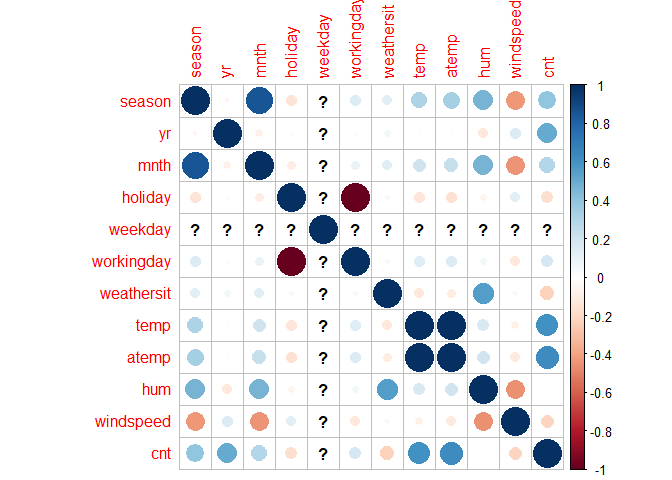

Report for One Day of Week
================
Rachel Keller
October 16, 2020

Introduction
============

The data we will be analyzing in this project is a daily count of rental
bikes between years 2011 and 2012 in the Capital bikeshare system. This
bike share data set includes information about the day of rental and the
weather on that particular day. Below is a list of the variables that
will be available for us to include in our models and a brief
description:

-   season : season (1:winter, 2:spring, 3:summer, 4:fall)
-   yr : year (0: 2011, 1:2012)
-   mnth : month ( 1 to 12)
-   hr : hour (0 to 23)
-   holiday : weather day is holiday or not
-   weekday : day of the week
-   workingday : if day is neither weekend nor holiday is 1, otherwise
    is 0
-   weathersit :
    -   1: Clear, Few clouds, Partly cloudy, Partly cloudy
    -   2: Mist + Cloudy, Mist + Broken clouds, Mist + Few clouds, Mist
    -   3: Light Snow, Light Rain + Thunderstorm + Scattered clouds,
        Light Rain + Scattered clouds
    -   4: Heavy Rain + Ice Pallets + Thunderstorm + Mist, Snow + Fog
-   temp : Normalized temperature in Celsius
-   atemp: Normalized feeling temperature in Celsius
-   hum: Normalized humidity
-   windspeed: Normalized wind speed
-   cnt: count of total rental bikes

The purpose of this analysis is to compare two models in terms of their
predictive performance. As this is a regression problem, we will use
RMSE to determine which model is the better fit. The models we will fit
are a non-ensemble tree model and a boosted tree model. Tuning
parameters for both models will be selected using leave one out cross
validation. We will fit both of these models on the training data set
and evaluate the RMSE on the test set.

Set Up and Required Packages
============================

We will load in our necessary packages, `tidyverse` and `caret`. We will
also set the seed, so our results are reproducible.

    set.seed(123)
    library(tidyverse)
    library(caret)

Reading in Data
===============

Using the `read_csv` function, we will read in the csv file of the bike
sharing data. With the use of the `select` function, we can remove the
casual and registered variables, which should not be used for modeling,
and any non-numeric variables, like dteday. Finally, using `filter`, we
will filter our data set by the specific day of the week we are
interested in analyzing for that report.

    bikeData <- read_csv("day.csv")
    bikeData <- bikeData %>% select(-c(casual, registered, instant, dteday)) %>% filter(weekday == params$dayofWeek)

Creating Training and Test Split
================================

Using `createDataPartition`, we will partition our data into the 70/30
training and test split.

    bikeDataIndex <- createDataPartition(bikeData$cnt, p = 0.7, list = FALSE)
    bikeDataTrain <- bikeData[bikeDataIndex, ]
    bikeDataTest <- bikeData[-bikeDataIndex, ]

Summarizations of Data
======================

    summary(bikeDataTrain)

    ##      season            yr              mnth           holiday      
    ##  Min.   :1.000   Min.   :0.0000   Min.   : 1.000   Min.   :0.0000  
    ##  1st Qu.:2.000   1st Qu.:0.0000   1st Qu.: 4.000   1st Qu.:0.0000  
    ##  Median :3.000   Median :1.0000   Median : 7.000   Median :0.0000  
    ##  Mean   :2.592   Mean   :0.5132   Mean   : 6.842   Mean   :0.1447  
    ##  3rd Qu.:4.000   3rd Qu.:1.0000   3rd Qu.:10.000   3rd Qu.:0.0000  
    ##  Max.   :4.000   Max.   :1.0000   Max.   :12.000   Max.   :1.0000  
    ##     weekday    workingday       weathersit         temp       
    ##  Min.   :1   Min.   :0.0000   Min.   :1.000   Min.   :0.1758  
    ##  1st Qu.:1   1st Qu.:1.0000   1st Qu.:1.000   1st Qu.:0.3600  
    ##  Median :1   Median :1.0000   Median :1.000   Median :0.4963  
    ##  Mean   :1   Mean   :0.8553   Mean   :1.408   Mean   :0.4889  
    ##  3rd Qu.:1   3rd Qu.:1.0000   3rd Qu.:2.000   3rd Qu.:0.6350  
    ##  Max.   :1   Max.   :1.0000   Max.   :3.000   Max.   :0.7817  
    ##      atemp             hum           windspeed           cnt      
    ##  Min.   :0.1768   Min.   :0.3022   Min.   :0.0423   Min.   :  22  
    ##  1st Qu.:0.3575   1st Qu.:0.5186   1st Qu.:0.1367   1st Qu.:3341  
    ##  Median :0.4834   Median :0.6527   Median :0.1797   Median :4350  
    ##  Mean   :0.4711   Mean   :0.6355   Mean   :0.1927   Mean   :4394  
    ##  3rd Qu.:0.5955   3rd Qu.:0.7364   3rd Qu.:0.2354   3rd Qu.:5890  
    ##  Max.   :0.7210   Max.   :0.9250   Max.   :0.4179   Max.   :7525

    corrplot::corrplot(cor(bikeDataTrain))

    ## Warning in cor(bikeDataTrain): the standard deviation is zero

<!-- -->

Models
======

Now that we have read in our data, created our split, and done some
exploratory data analysis, we will begin fitting our models. The goal is
to create two models that predict the cnt variable in our data set.

Nonensemble Tree Model
----------------------

The first model we will fit is a regression tree. The main idea of this
model is to split up our predictor space into regions, and for a given
region, use the main of the observations as our predictor value. For the
fitting process of this model, we will use leave one out cross
validation. For LOOCV, one observation is removed and the model is fit
on the remaining data, and this fit is used to predict the value of the
deleted observation. We repeated this process for each observation and
compute the mean square error. The data was also centered and scaled
using the `preProcess` function. The final choosen model will be the one
that minimzes the training RMSE. For the tuning parameter of cp, we will
use the default values rather than providing a grid of tuning
parameters.

    (treeFit <- train(cnt ~ ., data = bikeDataTrain,
                   method = "rpart",
                   preProcess = c("center", "scale"),
                   trControl = trainControl(method = "LOOCV")))

    ## CART 
    ## 
    ## 76 samples
    ## 11 predictors
    ## 
    ## Pre-processing: centered (11), scaled (11) 
    ## Resampling: Leave-One-Out Cross-Validation 
    ## Summary of sample sizes: 75, 75, 75, 75, 75, 75, ... 
    ## Resampling results across tuning parameters:
    ## 
    ##   cp          RMSE      Rsquared    MAE     
    ##   0.08328573  1413.586  0.38309639  1005.273
    ##   0.19314127  1606.978  0.21838272  1342.212
    ##   0.40741491  2016.666  0.02819295  1813.490
    ## 
    ## RMSE was used to select the optimal model using the smallest value.
    ## The final value used for the model was cp = 0.08328573.

The optimal model in this case used cp = 0.0832857. And we can see the
training RMSE obtained in the output above.

Boosted Tree Model
------------------

The final model we will fit is a boosted tree. This model builds off of
the previous in that we are sequentially fitting tree models. Each
subsequent tree is grown on a modified version of the training data, and
we update our predictions as the tree grows. For the fitting process of
this model, we will use leave one out cross validation. For LOOCV, one
observation is removed and the model is fit on the remaining data, and
this fit is used to predict the value of the deleted observation. We
repeated this process for each observation and compute the mean square
error. The data was also centered and scaled using the `preProcess`
function. The final choosen model will be the one that minimzes the
training RMSE. For the tuning parameters of number of trees, depth,
shrinkage, and minimum number of observations in a node, we will use the
default values rather than providing a grid of tuning parameters.

    (boostedtreeFit <- train(cnt ~ ., data = bikeDataTrain,
                   method = "gbm",
                   preProcess = c("center", "scale"),
                   trControl = trainControl(method = "LOOCV"),
                   verbose = FALSE))

    ## Stochastic Gradient Boosting 
    ## 
    ## 76 samples
    ## 11 predictors
    ## 
    ## Pre-processing: centered (11), scaled (11) 
    ## Resampling: Leave-One-Out Cross-Validation 
    ## Summary of sample sizes: 75, 75, 75, 75, 75, 75, ... 
    ## Resampling results across tuning parameters:
    ## 
    ##   n.trees  interaction.depth  RMSE       Rsquared   MAE     
    ##    50      1                  1014.0667  0.6739669  707.4817
    ##    50      2                   971.3852  0.6967004  651.2548
    ##    50      3                   974.8264  0.6935752  646.5094
    ##   100      1                   949.6966  0.7093957  632.9792
    ##   100      2                   918.0903  0.7280098  597.9190
    ##   100      3                   922.7432  0.7256436  576.0408
    ##   150      1                   945.4205  0.7115853  620.3063
    ##   150      2                   889.6111  0.7448300  561.2126
    ##   150      3                   904.3291  0.7365684  559.5280
    ## 
    ## Tuning parameter 'shrinkage' was held constant at a value of
    ##  0.1
    ## Tuning parameter 'n.minobsinnode' was held constant at a
    ##  value of 10
    ## RMSE was used to select the optimal model using the smallest value.
    ## The final values used for the model were n.trees =
    ##  150, interaction.depth = 2, shrinkage = 0.1 and n.minobsinnode = 10.

The optimal model in this case used n.trees = 150, interaction.depth =
2, shrinkage = 0.1, and n.minosbinnode = 10. And we can see the training
RMSE obtained in the output above.

Testing Models on Test Set
==========================

Now that we have determined the optimal fit of each model, we will apply
our models to the test set. First, we will obtain the test RMSE of the
tree model using `predict` and `postResample`.

    treePred <- predict(treeFit, newdata = bikeDataTest)
    (treeResults <- postResample(treePred, bikeDataTest$cnt))

    ##         RMSE     Rsquared          MAE 
    ## 1164.3766705    0.6173263  918.2484070

Again, we will use `predict` and `postResample` to obtain the test RMSE
of the boosted tree model.

    boostedtreePred <- predict(boostedtreeFit, newdata = bikeDataTest)
    (boostedtreeResults <- postResample(boostedtreePred, bikeDataTest$cnt))

    ##        RMSE    Rsquared         MAE 
    ## 684.2420983   0.8706079 478.2318413

The optimal model in this case is the boosted tree.
