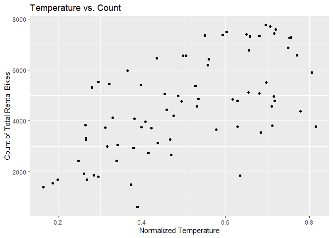
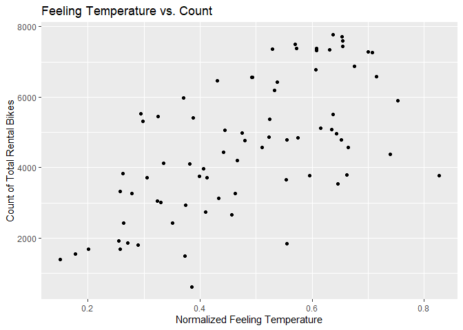
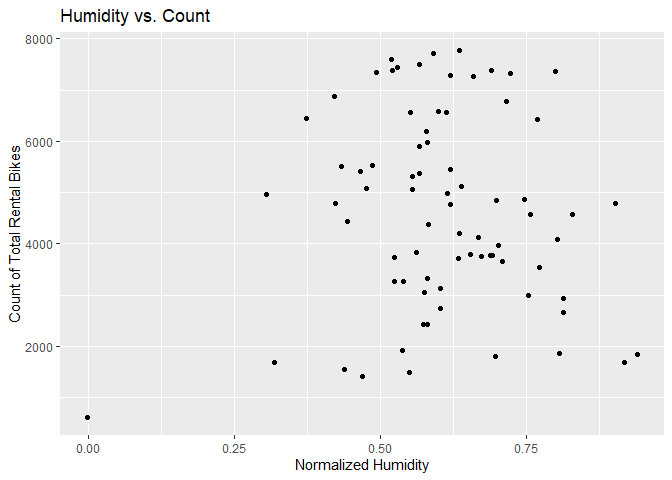
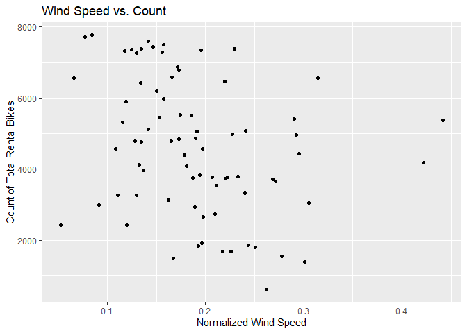

Introduction
============

The data we will be analyzing in this project is a daily count of rental
bikes between years 2011 and 2012 in the Capital bikeshare system. This
bike share data set includes information about the day of rental and the
weather on that particular day. Below is a list of the variables that
will be available for us to include in our models and a brief
description:

-   `season` : season (1:winter, 2:spring, 3:summer, 4:fall)
-   `yr` : year (0: 2011, 1:2012)
-   `mnth` : month ( 1 to 12)
-   `holiday` : weather day is holiday or not
-   `weekday` : day of the week
-   `workingday` : if day is neither weekend nor holiday is 1, otherwise
    is 0
-   `weathersit` :
    -   1: Clear, Few clouds, Partly cloudy, Partly cloudy
    -   2: Mist + Cloudy, Mist + Broken clouds, Mist + Few clouds, Mist
    -   3: Light Snow, Light Rain + Thunderstorm + Scattered clouds,
        Light Rain + Scattered clouds
    -   4: Heavy Rain + Ice Pallets + Thunderstorm + Mist, Snow + Fog
-   `temp` : Normalized temperature in Celsius
-   `atemp`: Normalized feeling temperature in Celsius
-   `hum`: Normalized humidity
-   `windspeed`: Normalized wind speed
-   `cnt`: count of total rental bikes

The purpose of this analysis is to compare two models in terms of their
predictive performance. As this is a regression problem, we will use
RMSE to determine which model is the better fit. The models we will fit
are a non-ensemble tree model and a boosted tree model. Tuning
parameters for both models will be selected using leave one out cross
validation. We will fit both of these models on the training data set
and evaluate the RMSE on the test set.

Loading Packages
================

We will load in our necessary packages, `tidyverse` and `caret`. We will
also set the seed, so our results are reproducible.

    set.seed(123)
    library(tidyverse)
    library(caret)
    library(ggplot2)

Reading in Data
===============

Using the `read_csv` function, we will read in the csv file of the bike
sharing data. With the use of the `select` function, we can remove the
`casual` and `registered` variables, which should not be used for
modeling, and any non-numeric variables, like `dteday`. Finally, using
`filter`, we will filter our data set by the specific day of the week we
are interested in analyzing for that report.

    bikeData <- read_csv("day.csv")
    bikeData <- bikeData %>% select(-c(casual, registered, instant, dteday)) %>% filter(weekday == params$dayofWeek)

Creating Training and Test Split
================================

Using `createDataPartition`, we will partition our data into the 70/30
training and test split.

    bikeDataIndex <- createDataPartition(bikeData$cnt, p = 0.7, list = FALSE)
    bikeDataTrain <- bikeData[bikeDataIndex, ]
    bikeDataTest <- bikeData[-bikeDataIndex, ]

Summarizations of Data
======================

First, we will take a look at the five number summary of each variable
available in the data set.

    summary(bikeDataTrain)

    ##      season            yr        
    ##  Min.   :1.000   Min.   :0.0000  
    ##  1st Qu.:2.000   1st Qu.:0.0000  
    ##  Median :3.000   Median :0.0000  
    ##  Mean   :2.579   Mean   :0.4737  
    ##  3rd Qu.:4.000   3rd Qu.:1.0000  
    ##  Max.   :4.000   Max.   :1.0000  
    ##       mnth           holiday       
    ##  Min.   : 1.000   Min.   :0.00000  
    ##  1st Qu.: 4.000   1st Qu.:0.00000  
    ##  Median : 7.000   Median :0.00000  
    ##  Mean   : 6.671   Mean   :0.02632  
    ##  3rd Qu.: 9.250   3rd Qu.:0.00000  
    ##  Max.   :12.000   Max.   :1.00000  
    ##     weekday    workingday       weathersit   
    ##  Min.   :4   Min.   :0.0000   Min.   :1.000  
    ##  1st Qu.:4   1st Qu.:1.0000   1st Qu.:1.000  
    ##  Median :4   Median :1.0000   Median :1.000  
    ##  Mean   :4   Mean   :0.9737   Mean   :1.395  
    ##  3rd Qu.:4   3rd Qu.:1.0000   3rd Qu.:2.000  
    ##  Max.   :4   Max.   :1.0000   Max.   :3.000  
    ##       temp            atemp       
    ##  Min.   :0.1650   Min.   :0.1509  
    ##  1st Qu.:0.3598   1st Qu.:0.3650  
    ##  Median :0.4963   Median :0.4861  
    ##  Mean   :0.5050   Mean   :0.4824  
    ##  3rd Qu.:0.6631   3rd Qu.:0.6190  
    ##  Max.   :0.8150   Max.   :0.8264  
    ##       hum           windspeed      
    ##  Min.   :0.0000   Min.   :0.05287  
    ##  1st Qu.:0.5361   1st Qu.:0.13635  
    ##  Median :0.6017   Median :0.18314  
    ##  Mean   :0.6080   Mean   :0.18966  
    ##  3rd Qu.:0.6978   3rd Qu.:0.22606  
    ##  Max.   :0.9396   Max.   :0.44156  
    ##       cnt      
    ##  Min.   : 623  
    ##  1st Qu.:3271  
    ##  Median :4670  
    ##  Mean   :4627  
    ##  3rd Qu.:6249  
    ##  Max.   :7765

From this output, we can see that the `yr`, `holiday`, and `workingday`
variables are binary, that is they take on values of 0 or 1. Also, the
`season`, `mnth`, and `weathersit` variables are categorical. We will
create contingency tables of these non-numeric variables and the count
of bikes shared. To create these tables, we will use the `aggregate`
function in combination with `kable`. First, we will create the table of
`year` and `cnt`.

    knitr::kable(aggregate(bikeDataTrain$cnt, by = list(bikeDataTrain$yr), FUN = sum), col.names = c("Year", "Sum of Count"))

| Year | Sum of Count |
|-----:|-------------:|
|    0 |       136300 |
|    1 |       215371 |

From the table, we can see that the bike share rented out more bikes in
the year 2012, suggesting that the bike sharing company had better
performance in the year 2012. Secondly, we will look at a table of the
`holiday` and `cnt`.

    knitr::kable(aggregate(bikeDataTrain$cnt, by = list(bikeDataTrain$holiday), FUN = sum), col.names = c("Holiday", "Sum of Count"))

| Holiday | Sum of Count |
|--------:|-------------:|
|       0 |       347751 |
|       1 |         3920 |

As expected, this bike sharing company does more business on
non-holidays. This makes logical sense as there are more of these days
in a year than holidays. Next, we will look at the table of
`workingdays` and `cnt`.

    knitr::kable(aggregate(bikeDataTrain$cnt, by = list(bikeDataTrain$workingday), FUN = sum), col.names = c("Working Day", "Sum of Count"))

| Working Day | Sum of Count |
|------------:|-------------:|
|           0 |         3920 |
|           1 |       347751 |

From the table, we can see that the count is higher for the weekdays,
rather than the weekends, this suggests that bike sharing may be
becoming a popular option for the work commute. The next table we will
create is of `season` and `cnt`.

    knitr::kable(aggregate(bikeDataTrain$cnt, by = list(bikeDataTrain$season), FUN = sum), col.names = c("Season", "Sum of Count"))

| Season | Sum of Count |
|-------:|-------------:|
|      1 |        53756 |
|      2 |        92975 |
|      3 |       115350 |
|      4 |        89590 |

The most popular seasons appear to be summer and fall. And the least
popular season to utilize the bike share is winter. Next, we will look
at a table of `mnth` and `cnt`.

    knitr::kable(aggregate(bikeDataTrain$cnt, by = list(bikeDataTrain$mnth), FUN = sum), col.names = c("Month", "Sum of Count"))

| Month | Sum of Count |
|------:|-------------:|
|     1 |        10702 |
|     2 |        19015 |
|     3 |        25166 |
|     4 |        24839 |
|     5 |        48357 |
|     6 |        34528 |
|     7 |        27295 |
|     8 |        54345 |
|     9 |        27643 |
|    10 |        26306 |
|    11 |        30634 |
|    12 |        22841 |

We can see that the most popular months are those that fall in the
summer and fall seasons. The last contingency table we will create is
for `weather` and `cnt`.

    knitr::kable(aggregate(bikeDataTrain$cnt, by = list(bikeDataTrain$weathersit), FUN = sum), col.names = c("Weather", "Sum of Count"))

| Weather | Sum of Count |
|--------:|-------------:|
|       1 |       245947 |
|       2 |       101574 |
|       3 |         4150 |

The bike share receives the most use when the weather is nice, with no
rain, snow, or thunderstorms. Now, we will create some histograms of the
remaining predictors and our reponse variable, `cnt`. We will create
these histograms using `ggplot` and `geom_jitter`. The first histogram
will contain our `temp` and `cnt` variables.

    g <- ggplot(bikeDataTrain, aes(x = temp, y = cnt))
    g + geom_jitter() + labs(x = "Normalized Temperature", y = "Count of Total Rental Bikes", title = "Temperature vs. Count")

<!-- -->

There is a clear positive trend in the histogram, as the temperature
becomes warmer, the number of rentals that day increases. The next
histogram we look at will contain the `atemp` and `cnt` variables.

    g <- ggplot(bikeDataTrain, aes(x = atemp, y = cnt))
    g + geom_jitter() + labs(x = "Normalized Feeling Temperature", y = "Count of Total Rental Bikes", title = "Feeling Temperature vs. Count")

<!-- -->

Much like the regular temperature, the temperature that it actually
feels like has a positive relationship with the number of rentals. Next,
we will create a histogram for the `hum` and `cnt` variables.

    g <- ggplot(bikeDataTrain, aes(x = hum, y = cnt))
    g + geom_jitter() + labs(x = "Normalized Humidity", y = "Count of Total Rental Bikes", title = "Humidity vs. Count")

<!-- -->

There doesn’t appear to be a definite relationship between the humidity
and the count of rental bikes. The final histogram will contain
`windspeed` and `cnt`.

    g <- ggplot(bikeDataTrain, aes(x = windspeed, y = cnt))
    g + geom_jitter() + labs(x = "Normalized Wind Speed", y = "Count of Total Rental Bikes", title = "Wind Speed vs. Count")

<!-- -->

There appears to be a slight negative relationship between wind speed
and the number of rentals that day. Next, we will move on to fitting our
models.

Models
======

Now that we have read in our data, created our split, and done some
exploratory data analysis, we will begin fitting our models. The goal is
to create two models that predict the `cnt` variable in our data set.

Non-ensemble Tree Model
-----------------------

The first model we will fit is a regression tree. The main idea of this
model is to split up our predictor space into regions, and for a given
region, use the main of the observations as our predictor value. For the
fitting process of this model, we will use leave one out cross
validation. For LOOCV, one observation is removed and the model is fit
on the remaining data, and this fit is used to predict the value of the
deleted observation. We repeated this process for each observation and
compute the mean square error. The data was also centered and scaled
using the `preProcess` function. The final choosen model will be the one
that minimzes the training RMSE. For the tuning parameter of cp, we will
use the default values rather than providing a grid of tuning
parameters.

    (treeFit <- train(cnt ~ ., data = bikeDataTrain,
                   method = "rpart",
                   preProcess = c("center", "scale"),
                   trControl = trainControl(method = "LOOCV")))

    ## CART 
    ## 
    ## 76 samples
    ## 11 predictors
    ## 
    ## Pre-processing: centered (11), scaled (11) 
    ## Resampling: Leave-One-Out Cross-Validation 
    ## Summary of sample sizes: 75, 75, 75, 75, 75, 75, ... 
    ## Resampling results across tuning parameters:
    ## 
    ##   cp         RMSE      Rsquared    MAE     
    ##   0.1352870  1289.153  0.54636622  1122.810
    ##   0.1875221  1460.027  0.40936541  1261.016
    ##   0.4667418  2119.234  0.01210054  1937.674
    ## 
    ## RMSE was used to select the optimal
    ##  model using the smallest value.
    ## The final value used for the model was cp
    ##  = 0.135287.

The optimal model in this case used cp = 0.135287. And we can see the
training RMSE obtained in the output above.

Boosted Tree Model
------------------

The final model we will fit is a boosted tree. This model builds off of
the previous in that we are sequentially fitting tree models. Each
subsequent tree is grown on a modified version of the training data, and
we update our predictions as the tree grows. For the fitting process of
this model, we will use leave one out cross validation. For LOOCV, one
observation is removed and the model is fit on the remaining data, and
this fit is used to predict the value of the deleted observation. We
repeated this process for each observation and compute the mean square
error. The data was also centered and scaled using the `preProcess`
function. The final choosen model will be the one that minimzes the
training RMSE. For the tuning parameters of number of trees, depth,
shrinkage, and minimum number of observations in a node, we will use the
default values rather than providing a grid of tuning parameters.

    (boostedtreeFit <- train(cnt ~ ., data = bikeDataTrain,
                   method = "gbm",
                   preProcess = c("center", "scale"),
                   trControl = trainControl(method = "LOOCV"),
                   verbose = FALSE))

    ## Stochastic Gradient Boosting 
    ## 
    ## 76 samples
    ## 11 predictors
    ## 
    ## Pre-processing: centered (11), scaled (11) 
    ## Resampling: Leave-One-Out Cross-Validation 
    ## Summary of sample sizes: 75, 75, 75, 75, 75, 75, ... 
    ## Resampling results across tuning parameters:
    ## 
    ##   n.trees  interaction.depth  RMSE    
    ##    50      1                  818.6342
    ##    50      2                  816.7642
    ##    50      3                  796.5218
    ##   100      1                  803.4951
    ##   100      2                  794.6579
    ##   100      3                  792.3171
    ##   150      1                  829.3350
    ##   150      2                  791.1471
    ##   150      3                  804.6850
    ##   Rsquared   MAE     
    ##   0.8169190  633.9327
    ##   0.8128866  623.4562
    ##   0.8227559  588.1070
    ##   0.8178997  609.8808
    ##   0.8217287  586.3566
    ##   0.8229736  570.5449
    ##   0.8058775  627.0085
    ##   0.8235661  578.5300
    ##   0.8175447  578.1584
    ## 
    ## Tuning parameter 'shrinkage' was held
    ##  parameter 'n.minobsinnode' was held
    ##  constant at a value of 10
    ## RMSE was used to select the optimal
    ##  model using the smallest value.
    ## The final values used for the model
    ##  were n.trees = 150, interaction.depth =
    ##  2, shrinkage = 0.1 and n.minobsinnode = 10.

The optimal model in this case used n.trees = 150, interaction.depth =
2, shrinkage = 0.1, and n.minosbinnode = 10. And we can see the training
RMSE obtained in the output above.

Testing Models
==============

Now that we have determined the optimal fit of each model, we will apply
our models to the test set. First, we will obtain the test RMSE of the
tree model using `predict` and `postResample`.

    treePred <- predict(treeFit, newdata = bikeDataTest)
    (treeResults <- postResample(treePred, bikeDataTest$cnt))

    ##         RMSE     Rsquared          MAE 
    ## 1316.5391122    0.5941258 1071.3061224

Again, we will use `predict` and `postResample` to obtain the test RMSE
of the boosted tree model.

    boostedtreePred <- predict(boostedtreeFit, newdata = bikeDataTest)
    (boostedtreeResults <- postResample(boostedtreePred, bikeDataTest$cnt))

    ##       RMSE   Rsquared        MAE 
    ## 859.492988   0.830317 687.534109

The optimal model in this case is the boosted tree. And the test RMSE
was minimized at 859.4929877.
